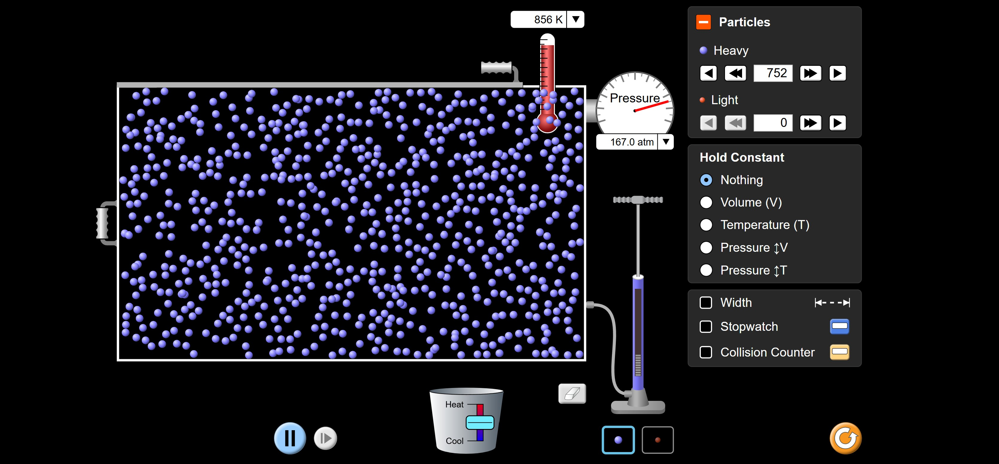

<!--
============================================================================
GUIDA: come generare il PDF
----------------------------------------------------------------------------
Apri il terminale in questa cartella (Laboratorio) e lancia:

    pandoc "Gas_perfetti_Simulata.md" -o "PDF/Gas_perfetti_Simulata.pdf"

Richiede pandoc + MiKTeX (pdflatex). L'immagine "Immagini/Gas_ideali.jpg"
deve trovarsi nella sottocartella Immagini.
============================================================================
-->

# Introduzione e obiettivi

Un gas chiuso in un recipiente è descritto da poche grandezze: la
**pressione** $P$, il **volume** $V$, la **temperatura** $T$ e la **quantità
di gas**. Queste grandezze non sono indipendenti: sono legate
dall'**equazione di stato dei gas perfetti**

$$P\,V = n\,R\,T$$

In questa esperienza useremo la simulazione **Gas Properties** del progetto
PhET, che ci permette di fare ciò che in un laboratorio reale è difficile:
**tenere ferma una grandezza** e osservare come le altre due si "muovono
insieme". Scopriremo così, una alla volta, le leggi dei gas — e le vedremo
anche dal punto di vista **microscopico**, guardando le particelle che
rimbalzano dentro il recipiente.

Gli obiettivi sono:

- capire il significato microscopico di pressione e temperatura di un gas;
- verificare la **legge di Boyle** ($P \cdot V$ costante a temperatura
  fissa);
- verificare la **seconda legge di Gay-Lussac** ($P/T$ costante a volume
  fisso);
- osservare che, a parità di volume e temperatura, la pressione è
  proporzionale al **numero di particelle**;
- ricomporre il puzzle: verificare che $P\,V/T$ è costante (equazione di
  stato) e capire **come le grandezze sono collegate tra loro**.

\newpage

# Richiami teorici

## Le variabili di stato di un gas

- **Pressione $P$.** È la forza che il gas esercita su ogni unità di
  superficie delle pareti. Nel SI si misura in **pascal** (Pa); la
  simulazione usa l'**atmosfera**: $1\ \text{atm} \approx 101\,325$ Pa (la
  pressione dell'aria al livello del mare).
- **Volume $V$.** Lo spazio occupato dal gas, che coincide con il volume del
  recipiente.
- **Temperatura $T$.** Nelle leggi dei gas va **sempre** espressa in
  **kelvin** (K), la temperatura *assoluta*:
  $$T(\text{K}) = t(^\circ\text{C}) + 273{,}15$$
  Lo zero della scala Kelvin ($0$ K $= -273{,}15\ ^\circ$C, lo **zero
  assoluto**) è la temperatura a cui le particelle sarebbero ferme.
- **Quantità di gas.** Si conta in **numero di particelle** $N$ oppure in
  **moli** $n$ (una mole $= 6{,}022\times10^{23}$ particelle).

## Il modello microscopico del gas perfetto

Un **gas perfetto** è un modello ideale: tante particelle puntiformi che si
muovono in modo disordinato, non interagiscono tra loro se non con **urti
elastici**, e rimbalzano sulle pareti. In questo modello:

- la **pressione** nasce dagli **urti** delle particelle contro le pareti:
  più urti (o urti più violenti) $\Rightarrow$ più pressione;
- la **temperatura** misura l'**energia cinetica media** delle particelle:
  gas più caldo $\Rightarrow$ particelle mediamente più veloci.

> Tenete a mente queste due idee: **ogni** legge che verificheremo si spiega
> contando gli urti sulle pareti!

## Le leggi dei gas

| Legge | Che cosa è fisso | Relazione | Come si legge |
|:------|:-----------------|:----------|:--------------|
| **Boyle** | $T$ (e la quantità di gas) | $P \cdot V = \text{cost}$ | $P$ e $V$ inversamente proporzionali |
| **1ª Gay-Lussac** (Charles) | $P$ | $\dfrac{V}{T} = \text{cost}$ | $V$ e $T$ direttamente proporzionali |
| **2ª Gay-Lussac** | $V$ | $\dfrac{P}{T} = \text{cost}$ | $P$ e $T$ direttamente proporzionali |

Le tre leggi si riassumono in un'unica **equazione di stato**:

$$\boxed{\;P\,V = n\,R\,T\;}$$

dove $R = 8{,}31\ \dfrac{\text{J}}{\text{mol}\cdot\text{K}}$ è la **costante
universale dei gas**. Equivalentemente: per una quantità fissata di gas, la
combinazione

$$\frac{P\,V}{T} = \text{costante}$$

non cambia, qualunque trasformazione si faccia.

## Il volume nella simulazione

Il recipiente della simulazione ha altezza e profondità **fisse**: quando
trasciniamo la maniglia cambia solo la **larghezza** $L$, che la simulazione
mostra in **nanometri** (nm). Il volume è quindi **proporzionale** alla
larghezza:

$$V = L \times (\text{area di base fissa}) \qquad\Longrightarrow\qquad V \propto L$$

Per le nostre verifiche va benissimo: se $P\cdot V$ è costante lo è anche
$P\cdot L$, e se $PV/T$ è costante lo è anche $PL/T$. Useremo perciò $L$ al
posto di $V$.

## Richiami di analisi dati: verificare che una quantità è "costante"

Nelle tabelle calcoleremo un prodotto (per esempio $P\cdot L$) o un rapporto
(per esempio $P/T$) su più righe. Per decidere se è "costante entro gli
errori":

1. si calcola la **media** $\bar{x}$ dei valori ottenuti;
2. per ogni valore si calcola lo **scarto percentuale dalla media**
   $$\delta_i\% = \frac{|x_i - \bar{x}|}{\bar{x}} \times 100;$$
3. se tutti gli scarti restano di **pochi percento** (compatibili con gli
   errori di lettura degli strumenti), la quantità è costante e la legge è
   verificata.

Errori di lettura nella simulazione: il manometro oscilla un po' (è
realistico: gli urti sono casuali!) — leggete il valore attorno a cui
oscilla; per la larghezza $\Delta L = 0{,}5$ nm; per la temperatura
$\Delta T = 1$ K.

\newpage

\begin{center}
\fbox{\parbox{0.95\linewidth}{\centering
Nome e cognome: \rule{4cm}{0.4pt} \quad Classe: \rule{1cm}{0.4pt} \quad
Data: \rule{2cm}{0.4pt} \\[4pt]
Componenti del gruppo: \rule{11cm}{0.4pt}
}}
\end{center}

\vspace{0.3cm}

# Scheda di laboratorio

## Materiale occorrente

- un **PC** (o tablet) con browser e connessione a internet;
- questa scheda, una matita e una calcolatrice.

## La simulazione PhET

1. Andate su **https://phet.colorado.edu** e cercate la simulazione
   **"Gas Properties"** (in italiano: *Proprietà del gas*) — oppure usate il
   collegamento diretto:
   \newline\small\texttt{https://phet.colorado.edu/sims/html/gas-properties/}
   \newline\texttt{latest/gas-properties\_all.html}\normalsize
2. Scegliete la schermata **Ideal** (gas ideale).

L'interfaccia (guardate la figura):

- il **recipiente** al centro: la **maniglia a sinistra** ne cambia la
  larghezza;
- la **pompa** a destra: trascinando su e giù il manico si immettono
  particelle; nel pannello **Particles** scegliete il tipo (**usate solo le
  Heavy**, quelle blu) e leggete/regolate il loro **numero esatto** con le
  freccette;
- il **termometro** (in kelvin) e il **manometro** (*Pressure*, in **atm**)
  sopra il recipiente;
- il **secchiello Heat/Cool** sotto il recipiente: trascinando la manopola
  verso *Heat* si scalda il gas, verso *Cool* si raffredda;
- il pannello **Hold Constant** ("tieni costante") a destra: è il cuore
  dell'esperienza! Sceglie quale grandezza la simulazione deve tenere
  **bloccata** mentre voi cambiate le altre;
- la casella **Width** mostra la **larghezza** $L$ del recipiente in nm:
  **spuntatela subito**.

{width=100%}

**Preparazione:**

1. spuntate **Width**;
2. con la pompa immettete circa $500$ particelle **Heavy**, poi aggiustate
   con le freccette a un numero "tondo" e **annotatelo**:
   $N = \underline{\hspace{2cm}}$ particelle;
3. verificate che il manometro sia in **atm**.

## Domande preparatorie

*Rispondete prima di iniziare le misure.*

**D1.** Guardate le particelle che rimbalzano: da che cosa è prodotta,
microscopicamente, la **pressione** che il manometro misura?

\vspace{1.2cm}

**D2.** Convertite: $0\ ^\circ$C $= \underline{\hspace{1.6cm}}$ K;
$\quad 27\ ^\circ$C $= \underline{\hspace{1.6cm}}$ K;
$\quad 600$ K $= \underline{\hspace{1.6cm}}\ ^\circ$C.

**D3.** *Previsione:* se comprimete il gas (recipiente più stretto) senza
cambiarne la temperatura, la pressione aumenterà o diminuirà? Spiegatelo
**contando gli urti**: nello spazio più piccolo le particelle colpiscono le
pareti più spesso o più raramente?

\vspace{1.5cm}

**D4.** La simulazione mostra la larghezza $L$ e non il volume $V$: perché
per verificare le leggi dei gas possiamo usare $L$ al posto di $V$?

\vspace{1.2cm}

## Esperimento A — La legge di Boyle ($T$ costante)

Nel pannello **Hold Constant** selezionate **Temperature (T)**: d'ora in poi
la simulazione manterrà la temperatura fissa, qualunque cosa facciate.

Annotate: $T = \underline{\hspace{2cm}}$ K \quad (resterà questa per tutto
l'esperimento).

Trascinate la **maniglia** e portate la larghezza a **quattro valori**
diversi (per esempio $L \approx 15$, $12$, $10$ e $8$ nm). Per ogni valore
aspettate che il manometro si stabilizzi e leggete la pressione:

| n° | $L$ (nm) | $P$ (atm) | $P \cdot L$ (atm$\cdot$nm) |
|:--:|:--------:|:---------:|:--------------------------:|
| 1  |          |           |                            |
| 2  |          |           |                            |
| 3  |          |           |                            |
| 4  |          |           |                            |

Media dei prodotti: $\overline{P L} = \underline{\hspace{2.5cm}}$
\quad Scarto percentuale massimo dalla media:
$\delta_{\max}\% = \underline{\hspace{2cm}}\%$

**Domanda A1.** *(Rispondete mentre misurate.)* Restringendo il recipiente,
la pressione è aumentata o diminuita? È andata come avevate previsto nella
domanda D3?

\vspace{1.2cm}

**Domanda A2.** Guardate le particelle quando il recipiente è stretto:
urtano le pareti più spesso o più raramente di quando è largo? La loro
**velocità media** è cambiata? (Ricordate: $T$ è bloccata!)

\vspace{1.2cm}

**Domanda A3.** Il prodotto $P\cdot L$ è costante entro pochi percento? La
legge di Boyle è verificata?

\vspace{1.2cm}

**Domanda A4.** Se dimezzate la larghezza, che cosa fa la pressione?
Verificatelo con due righe della vostra tabella.

\vspace{1.2cm}

## Esperimento B — La seconda legge di Gay-Lussac ($V$ costante)

Riportate la larghezza a un valore comodo e **non toccate più la maniglia**.
Nel pannello **Hold Constant** selezionate **Volume (V)**.

Annotate: $L = \underline{\hspace{2cm}}$ nm \quad (resterà questa per tutto
l'esperimento).

Con il **secchiello Heat/Cool** portate il gas a **quattro temperature**
diverse (per esempio $T \approx 300$, $400$, $500$ e $600$ K): scaldate,
aspettate che il termometro si stabilizzi, leggete $P$ e compilate:

| n° | $T$ (K) | $P$ (atm) | $P / T$ (atm/K) |
|:--:|:-------:|:---------:|:----------------:|
| 1  |         |           |                  |
| 2  |         |           |                  |
| 3  |         |           |                  |
| 4  |         |           |                  |

Media dei rapporti: $\overline{P/T} = \underline{\hspace{2.5cm}}$
\quad Scarto percentuale massimo:
$\delta_{\max}\% = \underline{\hspace{2cm}}\%$

**Domanda B1.** Scaldando il gas, le particelle si muovono più velocemente o
più lentamente? Di conseguenza gli urti sulle pareti diventano più frequenti
e più violenti, o il contrario?

\vspace{1.2cm}

**Domanda B2.** Il rapporto $P/T$ è costante? La seconda legge di Gay-Lussac
è verificata?

\vspace{1cm}

**Domanda B3.** Trovate (o create) nella tabella due righe in cui la
temperatura **raddoppia**: la pressione che cosa fa? Attenzione: funzionerebbe
anche usando i gradi Celsius al posto dei kelvin?

\vspace{1.2cm}

## Esperimento C — Pressione e numero di particelle ($T$ e $V$ costanti)

Tenete **Hold Constant = Temperature (T)** e non toccate la maniglia: così
restano bloccati sia $T$ sia $V$.

1. Annotate lo stato di partenza: $N_1 = \underline{\hspace{2cm}}$
   particelle, $P_1 = \underline{\hspace{2cm}}$ atm.
2. Con la pompa (o le freccette del pannello *Particles*) **raddoppiate** il
   numero di particelle: $N_2 = 2\,N_1 = \underline{\hspace{2cm}}$.
3. Leggete la nuova pressione: $P_2 = \underline{\hspace{2cm}}$ atm.

$$\frac{P_2}{P_1} = \underline{\hspace{2cm}}$$

**Domanda C1.** Raddoppiando le particelle la pressione è (circa)
raddoppiata? Spiegate perché con il modello degli urti.

\vspace{1.2cm}

**Domanda C2.** È quello che fate quando **gonfiate una gomma** della
bicicletta: il volume della camera d'aria quasi non cambia, la temperatura
nemmeno... che cosa state aumentando con la pompa?

\vspace{1.2cm}

## Esperimento D — Tutto insieme: l'equazione di stato

Ora togliete ogni vincolo: **Hold Constant = Nothing**. Riportate il numero
di particelle al valore iniziale $N$ dell'esperimento A.

Portate il gas in **due stati molto diversi** tra loro, cambiando **sia** la
larghezza **sia** la temperatura (maniglia + secchiello), e registrate tutto:

| Stato | $L$ (nm) | $P$ (atm) | $T$ (K) | $\dfrac{P \cdot L}{T}$ |
|:-----:|:--------:|:---------:|:-------:|:-----------------------:|
| 1 |  |  |  |  |
| 2 |  |  |  |  |

**Domanda D1.** I due valori di $\dfrac{P L}{T}$ coincidono entro pochi
percento? Che legge avete appena verificato?

\vspace{1.2cm}

**Domanda D2.** L'equazione di stato dice $PV = nRT$, cioè
$\dfrac{PV}{T} = nR$. Se **aggiungeste** particelle, il valore di
$\dfrac{P L}{T}$ resterebbe lo stesso? Perché? (Se avete tempo:
verificatelo!)

\vspace{1.2cm}

**Domanda D3.** Completate la mappa dei collegamenti: per un gas chiuso
(quantità fissa),

- a $T$ ferma: se $V$ scende, $P$ \underline{\hspace{2.2cm}};
- a $V$ fermo: se $T$ sale, $P$ \underline{\hspace{2.2cm}};
- a $P$ ferma: se $T$ sale, $V$ deve \underline{\hspace{2.2cm}}.

*(Per l'ultima riga: provate con Hold Constant = "Pressure* $\updownarrow$ *V"
e scaldate: la simulazione allarga da sola il recipiente per tenere ferma la
pressione!)*

## Conclusioni

**C1.** Riassumete: quali leggi avete verificato, e con quali scarti
percentuali massimi? Le ritenete verificate entro gli errori?

\vspace{1.5cm}

**C2.** Spiegate **con il modello microscopico** (urti delle particelle):
perché comprimere un gas a $T$ costante ne aumenta la pressione? Perché
scaldarlo a $V$ costante ne aumenta la pressione?

\vspace{1.8cm}

**C3.** Perché nelle leggi dei gas la temperatura deve essere in **kelvin**?
Che cosa andrebbe storto usando i gradi Celsius nel rapporto $P/T$?
(Suggerimento: che valore avrebbe il rapporto a $0\ ^\circ$C?)

\vspace{1.5cm}

**C4.** Per ciascuna situazione, dite quale legge dei gas c'entra:
(a) una **bomboletta spray** lasciata al sole può esplodere;
(b) uno **stantuffo di siringa** (col foro tappato) resiste quando lo
premete; (c) le **gomme dell'auto** in autostrada, scaldandosi, aumentano un
po' la loro pressione.

\vspace{1.8cm}

**C5.** Il gas della simulazione è **perfetto** per costruzione. Sapreste
indicare in quali condizioni un gas **reale** si comporta diversamente?
(Suggerimento: che cosa succede alle distanze tra le particelle ad
altissima pressione? E alle attrazioni tra molecole a bassissima
temperatura, vicino alla liquefazione?)

\vspace{1.8cm}

\begin{center}\textit{Fine dell'esperienza}\end{center}
