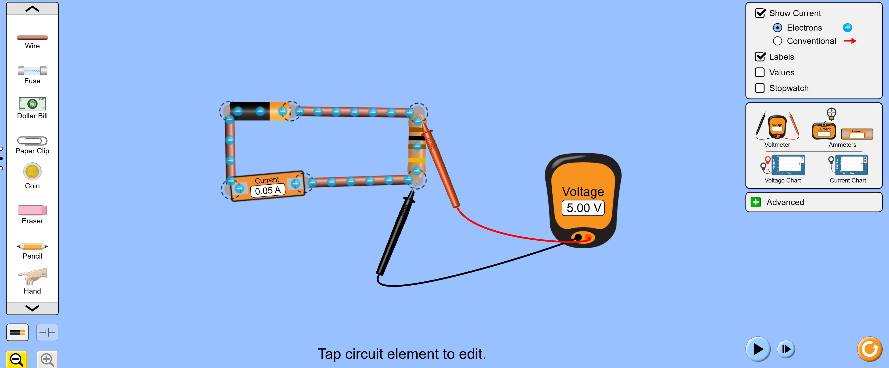

<!--
============================================================================
GUIDA: come generare il PDF
----------------------------------------------------------------------------
Apri il terminale in questa cartella (Laboratorio) e lancia:

    pandoc "Legge_di_Ohm_Simulata.md" -o "PDF/Legge_di_Ohm_Simulata.pdf"

Richiede pandoc + MiKTeX (pdflatex). L'immagine
"Immagini/Legge_di_Ohm_Simulata_circuito.jpg" deve trovarsi in questa cartella.
============================================================================
-->

# Introduzione e obiettivi

In questa esperienza studieremo la relazione tra la **differenza di potenziale**
applicata ai capi di un resistore e la **corrente** che lo attraversa,
verificando sperimentalmente la **legge di Ohm**. Questa volta, però, il
laboratorio sarà **virtuale**: costruiremo il circuito dentro una
**simulazione interattiva** — il *Circuit Construction Kit* del progetto
**PhET** dell'Università del Colorado — che si usa gratuitamente dal browser.

Anche se il circuito è simulato, il **metodo sperimentale è identico** a quello
del laboratorio reale: si prendono le misure, si stimano gli errori, si
costruisce il grafico e si confronta il risultato con il valore atteso.

Gli obiettivi sono:

- capire il significato fisico di corrente, differenza di potenziale e resistenza;
- imparare a costruire e modificare un circuito in un laboratorio virtuale,
  collegando correttamente **amperometro** (in serie) e **voltmetro** (in parallelo);
- verificare sperimentalmente che $V$ e $I$ sono proporzionali (legge di Ohm);
- misurare la resistenza $R$ con due metodi: media dei rapporti e metodo grafico;
- verificare il valore ottenuto confrontandolo con quello impostato nella
  simulazione e con il **codice dei colori** del resistore disegnato.

\newpage

# Richiami teorici

## Corrente elettrica, differenza di potenziale e resistenza

**Corrente elettrica $I$:** è il flusso ordinato di cariche elettriche attraverso
un conduttore. Si misura in **ampere** (A). Intuitivamente, è analoga alla portata
di un tubo idraulico: quante cariche passano attraverso una sezione del conduttore
in un secondo.

**Differenza di potenziale $V$ (o tensione):** è la "spinta" che mette in moto le
cariche. Si misura in **volt** (V). È analoga alla differenza di pressione che fa
scorrere l'acqua in un tubo: senza differenza di pressione non c'è flusso; senza
differenza di potenziale non c'è corrente.

**Resistenza $R$:** è la proprietà di un materiale di opporsi al passaggio della
corrente. Si misura in **ohm** ($\Omega$). Un conduttore con resistenza alta lascia
passare poca corrente per una data tensione; uno con resistenza bassa ne lascia
passare molta.

## La legge di Ohm

Georg Simon Ohm (1827) scoprì che, per molti materiali e a temperatura costante,
la corrente che attraversa un conduttore è **direttamente proporzionale** alla
differenza di potenziale applicata:

$$\boxed{V = R \cdot I}$$

La costante di proporzionalità è la resistenza $R$. Confrontandola con l'equazione
di una retta $y = m \cdot x$:

| Retta nel piano | Legge di Ohm |
|:----------------|:-------------|
| $y = m \cdot x$ | $V = R \cdot I$ |
| $y$ → variabile dipendente | $V$ → tensione (V) |
| $x$ → variabile indipendente | $I$ → corrente (A) |
| $m$ → coefficiente angolare | $R$ → resistenza ($\Omega$) |
| retta per l'origine | se $I = 0$, allora $V = 0$ |

Se la legge di Ohm è valida, riportando $V$ (asse $y$) in funzione di $I$ (asse
$x$), i punti sperimentali si disporranno su una **retta passante per l'origine**
con pendenza $R$.

> **Nota.** I materiali che obbediscono alla legge di Ohm si chiamano **ohmici**
> (o lineari). Non tutti i componenti elettronici sono ohmici: diodi e transistor,
> per esempio, hanno una caratteristica non lineare.

## Collegamento in serie e in parallelo

```{=latex}
\begin{figure}[H]
\centering
\begin{tikzpicture}[font=\footnotesize, line width=0.8pt]
  % --- SERIE ---
  \node[font=\small\bfseries] at (2.0, 1.0) {Serie};
  % filo superiore
  \draw (0,0) -- (1.0,0);
  % R1
  \draw (1.0,-0.25) rectangle (2.0,0.25);
  \node at (1.5,0) {$R_1$};
  % filo centrale
  \draw (2.0,0) -- (3.0,0);
  % R2
  \draw (3.0,-0.25) rectangle (4.0,0.25);
  \node at (3.5,0) {$R_2$};
  % filo finale
  \draw (4.0,0) -- (5.0,0);
  % frecce corrente
  \draw[-{Latex}] (0.3,0.15) -- (0.7,0.15) node[above,midway,font=\scriptsize] {$I$};
  \draw[-{Latex}] (2.3,0.15) -- (2.7,0.15) node[above,midway,font=\scriptsize] {$I$};
  \draw[-{Latex}] (4.3,0.15) -- (4.7,0.15) node[above,midway,font=\scriptsize] {$I$};
  % etichetta stessa corrente
  \node[font=\scriptsize, gray] at (2.5,-0.7) {stessa corrente in ogni punto};

  % --- PARALLELO ---
  \node[font=\small\bfseries] at (9.5, 1.0) {Parallelo};
  % nodi
  \draw (7.0,0) -- (7.5,0);
  \draw (7.5,0) -- (7.5, 0.6);
  \draw (7.5,0) -- (7.5,-0.6);
  % ramo superiore R1
  \draw (7.5, 0.6) -- (8.5,0.6);
  \draw (8.5,-0.25+0.6) rectangle (9.5,0.25+0.6);
  \node at (9.0,0.6) {$R_1$};
  \draw (9.5,0.6) -- (10.5,0.6);
  % ramo inferiore R2
  \draw (7.5,-0.6) -- (8.5,-0.6);
  \draw (8.5,-0.25-0.6) rectangle (9.5,0.25-0.6);
  \node at (9.0,-0.6) {$R_2$};
  \draw (9.5,-0.6) -- (10.5,-0.6);
  % nodo finale
  \draw (10.5,0.6) -- (10.5,0);
  \draw (10.5,-0.6) -- (10.5,0);
  \draw (10.5,0) -- (11.0,0);
  % frecce corrente
  \draw[-{Latex}] (7.1,0.15) -- (7.4,0.15) node[above,midway,font=\scriptsize] {$I$};
  \draw[-{Latex}] (8.0,0.75) -- (8.4,0.75) node[above,midway,font=\scriptsize] {$I_1$};
  \draw[-{Latex}] (8.0,-0.45) -- (8.4,-0.45) node[above,midway,font=\scriptsize] {$I_2$};
  \node[font=\scriptsize, gray] at (9.5,-1.3) {stessa tensione ai capi};
\end{tikzpicture}
\caption{In serie la stessa corrente $I$ attraversa tutti i componenti; in parallelo la stessa tensione è applicata a tutti i rami, ma la corrente si divide ($I = I_1 + I_2$).}
\end{figure}
```

### Perché l'amperometro va in serie e il voltmetro in parallelo

**Amperometro** (misura la corrente): deve essere attraversato dalla stessa
corrente del componente in esame, quindi si inserisce **in serie**. Per non
alterare il circuito, ha una resistenza interna **molto bassa** (idealmente zero).

**Voltmetro** (misura la tensione): deve essere collegato ai due terminali del
componente in esame, quindi si inserisce **in parallelo**. Per non deviare
corrente dal circuito, ha una resistenza interna **molto alta** (idealmente
infinita).

> **Attenzione.** Non collegare mai un amperometro direttamente in parallelo tra
> due punti a tensione diversa: la sua bassa resistenza interna causerebbe una
> corrente enorme, danneggiando sia lo strumento che il circuito. (Nella
> simulazione non si rompe niente... ma prendete l'abitudine giusta!)

## Il codice dei colori dei resistori

I resistori a strato di carbonio hanno il valore di resistenza codificato con
**4 fasce colorate**. Le prime due cifre significative, il moltiplicatore e la
tolleranza si leggono così:

| Colore   | Cifra | Moltiplicatore | Tolleranza |
|:---------|:-----:|:--------------:|:----------:|
| Nero     | 0     | $\times 1$     | —          |
| Marrone  | 1     | $\times 10$    | ±1%        |
| Rosso    | 2     | $\times 100$   | ±2%        |
| Arancione| 3     | $\times 1\,\text{k}$ | —    |
| Giallo   | 4     | $\times 10\,\text{k}$ | —   |
| Verde    | 5     | $\times 100\,\text{k}$| ±0,5%|
| Blu      | 6     | $\times 1\,\text{M}$ | ±0,25%|
| Viola    | 7     | $\times 10\,\text{M}$| —     |
| Grigio   | 8     | —              | —          |
| Bianco   | 9     | —              | —          |
| Oro      | —     | $\times 0{,}1$ | ±5%        |
| Argento  | —     | $\times 0{,}01$| ±10%       |

La figura seguente mostra come si legge il codice su un resistore da $1{,}0\ \text{k}\Omega \pm 5\%$:

```{=latex}
\begin{figure}[H]
\centering
\begin{tikzpicture}[font=\footnotesize, line width=0.8pt]
  % terminali
  \draw (-1.2,0) -- (0.3,0);
  \draw (6.3,0) -- (7.5,0);
  % corpo (beige)
  \fill[yellow!15!white] (0.3,-0.55) rectangle (6.3,0.55);
  % fascia 1: Marrone
  \fill[brown] (0.8,-0.55) rectangle (1.4,0.55);
  % fascia 2: Nero
  \fill[black] (2.0,-0.55) rectangle (2.6,0.55);
  % fascia 3: Rosso (×100)
  \fill[red] (3.2,-0.55) rectangle (3.8,0.55);
  % fascia 4: Oro (±5%) — spostata verso destra
  \fill[yellow!65!orange] (5.2,-0.55) rectangle (5.8,0.55);
  % contorno corpo
  \draw (0.3,-0.55) rectangle (6.3,0.55);
  % etichette sopra
  \node[above, font=\scriptsize] at (1.1, 0.55) {1ª};
  \node[above, font=\scriptsize] at (2.3, 0.55) {2ª};
  \node[above, font=\scriptsize] at (3.5, 0.55) {3ª};
  \node[above, font=\scriptsize] at (5.5, 0.55) {4ª};
  % frecce e label sotto
  \draw[-{Latex}] (1.1,-1.0) -- (1.1,-0.58);
  \node[below, align=center, font=\scriptsize] at (1.1,-1.05) {Marrone\\$= 1$};
  \draw[-{Latex}] (2.3,-1.0) -- (2.3,-0.58);
  \node[below, align=center, font=\scriptsize] at (2.3,-1.05) {Nero\\$= 0$};
  \draw[-{Latex}] (3.5,-1.0) -- (3.5,-0.58);
  \node[below, align=center, font=\scriptsize] at (3.5,-1.05) {Rosso\\$\times\,100$};
  \draw[-{Latex}] (5.5,-1.0) -- (5.5,-0.58);
  \node[below, align=center, font=\scriptsize] at (5.5,-1.05) {Oro\\$\pm\,5\%$};
  % risultato
  \node[above, font=\small] at (3.3, 1.1) {$R = 10 \times 100\ \Omega = 1{,}0\ \text{k}\Omega \pm 5\%$};
\end{tikzpicture}
\caption{Lettura del codice dei colori: Marrone--Nero--Rosso--Oro. Le prime due fasce danno le cifre significative (1 e 0 = 10), la terza il moltiplicatore ($\times 100$), la quarta la tolleranza (±5\%).}
\end{figure}
```

> **Nella simulazione.** Anche il resistore disegnato dal *Circuit Construction
> Kit* mostra le fasce colorate, e le fasce **cambiano** quando cambiate il
> valore della resistenza: potrete usarle per un controllo in più alla fine
> dell'esperienza.

## Propagazione dell'errore su $R$

La resistenza si stima da ogni misura come $R_i = V_i / I_i$. Poiché è un
rapporto, l'errore relativo si propaga come:

$$\frac{\Delta R}{R} = \frac{\Delta V}{V} + \frac{\Delta I}{I}
\qquad\Longrightarrow\qquad
\Delta R = R\left(\frac{\Delta V}{V} + \frac{\Delta I}{I}\right)$$

In pratica stimeremo l'incertezza su $R$ con la semidispersione e lo scarto
quadratico medio dei valori $R_i$ calcolati per ogni misura, esattamente come
abbiamo fatto nelle esperienze precedenti.

\newpage

\begin{center}
\fbox{\parbox{0.95\linewidth}{\centering
Nome e cognome: \rule{4cm}{0.4pt} \quad Classe: \rule{1cm}{0.4pt} \quad
Data: \rule{2cm}{0.4pt} \\[4pt]
Componenti del gruppo: \rule{11cm}{0.4pt}
}}
\end{center}

\vspace{0.3cm}

# Scheda di laboratorio

## Materiale occorrente

- un **PC** (o tablet) con browser e connessione a internet;
- questa scheda, una matita, un righello e una calcolatrice.

## La simulazione PhET

1. Andate su **https://phet.colorado.edu** (le simulazioni PhET
   dell'Università del Colorado sono gratuite).
2. Cercate la simulazione **"Circuit Construction Kit"** (in italiano:
   *Kit creazione circuiti*) e aprite la versione **AC** — in alternativa
   potete usare il collegamento diretto:
   \newline\small\texttt{https://phet.colorado.edu/sims/html/circuit-construction-kit-ac/}
   \newline\texttt{latest/circuit-construction-kit-ac\_all.html}\normalsize
3. Nella schermata iniziale scegliete la prima scheda (**Intro**).

L'interfaccia è organizzata così:

- a **sinistra** c'è la cassetta dei componenti per costruire il circuito:
  fili, batterie, resistori, lampadine, interruttori... (scorrete l'elenco con
  le frecce in alto e in basso; in fondo trovate anche oggetti di uso comune,
  da provare nell'ultima domanda);
- a **destra** ci sono gli **strumenti di misura** da aggiungere: il
  **voltmetro**, gli **amperometri** e i grafici (*Voltage Chart*,
  *Current Chart*);
- sempre a destra, in alto, alcune caselle: **Show Current** (mostra il moto
  delle cariche nel circuito), **Labels** (mostra i nomi dei componenti),
  **Values** (mostra i valori impostati). Per questa esperienza tenete
  **Labels** attivo e **Values** disattivato, come nella figura seguente.

> **Curiosità.** Con *Show Current* potete scegliere tra **Electrons** (il moto
> reale degli elettroni, dal polo $-$ al polo $+$) e **Conventional** (il verso
> convenzionale della corrente, opposto): è la stessa distinzione che abbiamo
> studiato a lezione!

## Esperimento A — Costruite il circuito

Costruite un circuito **identico a quello in figura**:

{width=100%}

Procedete così:

1. **Trascinate** nell'area di lavoro una **batteria**, un **resistore** e i
   **fili** necessari. Per collegare due elementi basta avvicinare i loro
   terminali (i cerchietti agli estremi): si "agganciano" da soli. Per
   staccare un collegamento, cliccate sul nodo e usate l'icona a **forbici**;
   per eliminare un elemento, selezionatelo e premete il **cestino**.
2. Inserite un **amperometro in serie** nel circuito (nel pannello di destra,
   sotto *Ammeters*, c'è l'amperometro "in linea": è un tratto di circuito a
   tutti gli effetti, come nella figura, dove indica la corrente che circola).
3. Prendete il **voltmetro** dal pannello di destra e collegate i suoi due
   puntali (rosso e nero) **ai due capi del resistore**: è il collegamento
   **in parallelo**.
4. Osservate le cariche che si muovono nel circuito: se il circuito è chiuso
   correttamente, il voltmetro mostra una tensione e l'amperometro una
   corrente.

**Impostate i valori iniziali.**

- Cliccate sul **resistore**: compare un cursore con cui scegliere la
  resistenza. Scegliete un valore "non banale" tra $40\ \Omega$ e
  $110\ \Omega$ e **annotatelo solo alla fine** dell'esperienza — meglio
  ancora: fate impostare il valore a **un solo componente del gruppo**, senza
  che gli altri lo vedano. Sarà la misura a rivelarlo!
- Cliccate sulla **batteria**: compare il cursore della differenza di
  potenziale. La farete variare durante la raccolta dati.

## Domande preparatorie

*Rispondete prima di iniziare le misure.*

**D1.** Enunciate la legge di Ohm. Se raddoppiamo la tensione applicata a una
resistenza omica, cosa succede alla corrente?

\vspace{1.8cm}

**D2.** Perché l'amperometro va collegato **in serie** e il voltmetro
**in parallelo**?

\vspace{1.8cm}

**D3.** Un resistore ha le fasce **Giallo–Viola–Marrone–Oro**: ricavate il
valore nominale e la tolleranza usando la tabella dei colori.

\vspace{1.8cm}

## Strumenti di misura

Nella simulazione gli strumenti mostrano i valori con **due cifre decimali**
(per esempio $5{,}00$ V oppure $0{,}05$ A): anche in un laboratorio virtuale la
lettura ha una risoluzione! Assumete come errore massimo **una unità
sull'ultima cifra** mostrata.

| Strumento | Grandezza misurata | Sensibilità | Errore massimo |
|:----------|:------------------:|:-----------:|:--------------:|
| Voltmetro della simulazione | Tensione $V$ (V) | 0,01 V | $\Delta V = 0{,}01$ V |
| Amperometro della simulazione | Corrente $I$ (A) | 0,01 A | $\Delta I = 0{,}01$ A |

## Esperimento B — Raccolta dati: tensione e corrente

Ora raccogliete le coppie di valori $(V,\ I)$:

1. cliccate sulla **batteria** e impostate la differenza di potenziale a
   $V = 5$ V;
2. leggete la corrente $I$ sull'**amperometro** e la tensione $V$ sul
   **voltmetro** (deve coincidere con quella impostata: il resistore è l'unico
   elemento del circuito);
3. **aumentate la tensione a scalini di 5 V** ($5,\ 10,\ 15,\ 20,\ \dots$ V) e
   ripetete la lettura, fino ad avere **almeno 10 misure**;
4. per ogni riga calcolate $R_i = V_i / I_i$.

| n° | $V_i$ (V) | $I_i$ (A) | $R_i = V_i/I_i$ ($\Omega$) |
|:--:|:---------:|:---------:|:--------------------------:|
| 1  |           |           |                            |
| 2  |           |           |                            |
| 3  |           |           |                            |
| 4  |           |           |                            |
| 5  |           |           |                            |
| 6  |           |           |                            |
| 7  |           |           |                            |
| 8  |           |           |                            |
| 9  |           |           |                            |
| 10 |           |           |                            |

> **Suggerimento.** Se con il vostro valore di $R$ la corrente resta molto
> piccola (per esempio sempre sotto $0{,}10$ A), le letture a due decimali
> diventano poco precise: riducete un po' la resistenza e ripartite da capo.

## Esperimento C — Calcolo di $\bar{R}$ e della sua incertezza

### Valore medio

$$\bar{R} = \frac{R_1 + R_2 + \cdots + R_{10}}{10} = \underline{\hspace{3cm}}\ \Omega$$

### Semidispersione

$$\Delta R_{\text{semidisp.}} = \frac{R_{\max} - R_{\min}}{2} = \underline{\hspace{3cm}}\ \Omega$$

### Scarto quadratico medio

| n° | $R_i$ ($\Omega$) | $d_i = R_i - \bar{R}$ | $d_i^{\,2}$ |
|:--:|:----------------:|:---------------------:|:-----------:|
| 1  |                  |                       |             |
| 2  |                  |                       |             |
| 3  |                  |                       |             |
| 4  |                  |                       |             |
| 5  |                  |                       |             |
| 6  |                  |                       |             |
| 7  |                  |                       |             |
| 8  |                  |                       |             |
| 9  |                  |                       |             |
| 10 |                  |                       |             |
| **somma** | | | $\sum d_i^2 =$ |

$$\sigma_R = \sqrt{\frac{\sum_{i=1}^{10}(R_i - \bar{R})^2}{10}} = \underline{\hspace{3cm}}\ \Omega$$

### Risultato finale

$$R = \underline{\hspace{3cm}} \ \pm\ \underline{\hspace{2cm}}\ \Omega$$

**Errore relativo e percentuale:**

$$\varepsilon_R = \frac{\Delta R}{\bar{R}} = \underline{\hspace{2.5cm}}
\qquad\qquad
\varepsilon_R\% = \underline{\hspace{2.5cm}}\%$$

\newpage

## Esperimento D — Metodo grafico

### Costruzione del grafico

Riportate i punti sperimentali sulla griglia qui sotto (o su carta
millimetrata):

- **asse $x$**: corrente $I$ (A) — scegliete la scala in base ai vostri dati e
  scrivete i valori sulle righette;
- **asse $y$**: tensione $V$ (V) — idem (per esempio 5 V per divisione).

Tracciate poi **con il righello** la retta che meglio interpola i punti.
Secondo la legge di Ohm deve passare per l'**origine**: se non ci passa,
segnalatelo come possibile errore sistematico.

```{=latex}
\begin{figure}[H]
\centering
\begin{tikzpicture}[font=\footnotesize, x=1.1cm, y=0.5cm]
  % griglia di supporto
  \draw[gray!35, xstep=1, ystep=1] (0,0) grid (12,12);
  % assi
  \draw[-{Latex}, thick] (-0.15,0) -- (12.6,0) node[above=4pt]{$I$ (A)};
  \draw[-{Latex}, thick] (0,-0.15) -- (0,12.7) node[right=3pt]{$V$ (V)};
  % righette da compilare su x
  \foreach \x in {1,...,12} {
    \draw[thick] (\x,0) -- (\x,-0.3);
    \node[below, font=\tiny] at (\x,-0.35) {\rule{0.55cm}{0.4pt}};
  }
  % righette da compilare su y
  \foreach \y in {1,...,12} {
    \draw[thick] (0,\y) -- (-0.18,\y);
    \node[left, font=\tiny] at (-0.22,\y) {\rule{0.4cm}{0.4pt}};
  }
\end{tikzpicture}
\caption{Griglia per il grafico $V$ in funzione di $I$: scrivete voi i valori
delle divisioni sui due assi, in base ai dati raccolti.}
\end{figure}
```

### Calcolo di $R$ dal coefficiente angolare

Scegliete due punti ben distanziati **sulla retta** e calcolate la pendenza:

$$R = \frac{V_2 - V_1}{I_2 - I_1}$$

Punto 1 sulla retta: $I_1 = \underline{\hspace{2cm}}$ A, $\quad V_1 = \underline{\hspace{2cm}}$ V

Punto 2 sulla retta: $I_2 = \underline{\hspace{2cm}}$ A, $\quad V_2 = \underline{\hspace{2cm}}$ V

$$R_{\text{graf}} = \frac{V_2 - V_1}{I_2 - I_1} = \underline{\hspace{3cm}}\ \Omega$$

## Esperimento E — La verifica finale

È il momento della verità: quanto vale davvero la resistenza della simulazione?

**1. Il codice dei colori.** Prima di cliccare, osservate da vicino le
**fasce colorate** del resistore disegnato e decodificatele con la tabella dei
colori:

| Fascia | Colore | Valore |
|:------:|:-------|:------:|
| 1ª (prima cifra) | | |
| 2ª (seconda cifra) | | |
| 3ª (moltiplicatore) | | |

$$R_{\text{colori}} = \underline{\hspace{3cm}}\ \Omega$$

**2. Il valore impostato.** Ora cliccate sul **resistore** e leggete sul
cursore il valore esatto della resistenza:

$$R_{\text{sim}} = \underline{\hspace{3cm}}\ \Omega$$

**3. Il confronto.** La vostra misura è **compatibile** con il valore della
simulazione se $R_{\text{sim}}$ cade nell'intervallo
$[\bar{R} - \Delta R,\ \bar{R} + \Delta R]$:

$$\bar{R} - \Delta R = \underline{\hspace{2.5cm}}\ \Omega
\qquad
\bar{R} + \Delta R = \underline{\hspace{2.5cm}}\ \Omega$$

$R_{\text{sim}}$ è dentro l'intervallo? \quad SÌ \; / \; NO

## Conclusioni

**C1.** Il grafico $V$ vs $I$ è una retta passante per l'origine? La legge di
Ohm è verificata per il resistore della simulazione? Motivate la risposta.

\vspace{1.5cm}

**C2.** Confrontate $\bar{R}$ (media dei rapporti), $R_{\text{graf}}$ (metodo
grafico), $R_{\text{colori}}$ (fasce) e $R_{\text{sim}}$ (valore impostato):
sono tutti compatibili tra loro?

\vspace{1.5cm}

**C3.** Anche in una simulazione le misure hanno un errore: da dove viene, in
questo caso? Quali fonti di errore del laboratorio reale invece **mancano**
nella simulazione?

\vspace{1.5cm}

**C4.** *(Per esplorare.)* Nella cassetta dei componenti, in fondo, ci sono
oggetti di uso comune: una **moneta**, una **gomma**, una **matita**, una
**banconota**... Provate a inserirli nel circuito al posto del resistore:
quali conducono la corrente e quali no? Che cosa potete concludere sui
materiali di cui sono fatti?

\vspace{1.5cm}

\begin{center}\textit{Fine dell'esperienza}\end{center}
