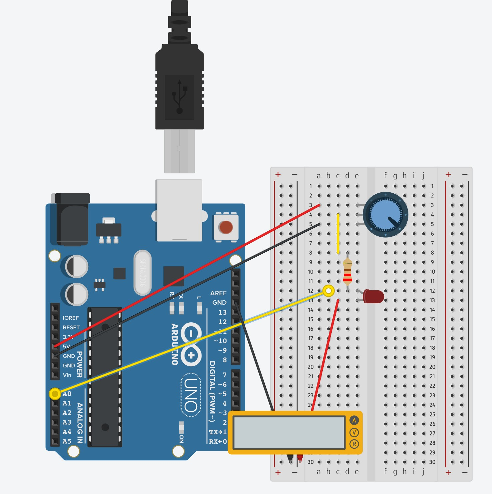

# 1 Introduzione e obiettivi

In questa esperienza sfrutteremo il principio dell'effetto fotoelettrico (nella sua variante "inversa" all'interno dei LED) per stimare il valore della costante di Planck $h$. Utilizzeremo un circuito controllato con Arduino per determinare la tensione di accensione (o tensione di soglia) di LED di diversi colori.

Gli obiettivi di questa scheda sono:
* comprendere il principio di funzionamento dei LED e la relazione tra energia e frequenza della luce;
* costruire un circuito con Arduino e un potenziometro per variare la tensione;
* misurare la tensione di soglia per LED di colore rosso, verde e blu utilizzando un amperometro;
* stimare la costante di Planck $h$ propagando correttamente l'incertezza sulla frequenza;
* ricavare $h$ anche tramite un'analisi grafica.


# 2 Richiami teorici

## 2.1 L'effetto fotoelettrico e i LED
L'effetto fotoelettrico, spiegato da Albert Einstein nel 1905, dimostra che la luce non è solo un'onda, ma è composta da "pacchetti" di energia chiamati **fotoni**. L'energia $E$ di un singolo fotone è direttamente proporzionale alla sua frequenza $f$ secondo la legge:
$$ E = h f $$
dove $h$ è la **costante di Planck**.

Un **LED** (Light Emitting Diode - Diodo a emissione di luce) funziona in base a un processo che è l'inverso dell'effetto fotoelettrico: l'energia elettrica fornita dal circuito spinge gli elettroni a "saltare" un dislivello di energia. Quando compiono questo salto, gli elettroni rilasciano l'energia in eccesso sotto forma di un fotone di luce.
L'energia fornita all'elettrone dal circuito elettrico è data dal prodotto tra la carica fondamentale dell'elettrone ($e$) e la tensione elettrica ($V$) applicata ai capi del LED:
$$ E = e V $$

Affinché il LED inizi a emettere luce, l'energia elettrica deve essere almeno pari a quella del fotone che verrà emesso. Uguagliando le due energie, otteniamo:
$$ e V = h f $$

Da questa relazione, conoscendo la carica dell'elettrone ($e = 1,602 \times 10^{-19} \text{ C}$), la frequenza della luce emessa dal LED ($f$) e misurando la tensione minima necessaria per accendere il LED (chiamata **tensione di soglia** $V_s$), possiamo calcolare la costante di Planck:
$$ h = \frac{e V_s}{f} $$


## 2.2 Il LED e la resistenza di protezione
Un LED è un componente **polarizzato**, ovvero permette il passaggio della corrente in un solo verso. Possiede due "piedini" (reofori) di lunghezza diversa:
* il piedino **lungo** è l'**anodo** (polo positivo, da collegare alla tensione più alta);
* il piedino **corto** è il **catodo** (polo negativo, da collegare a terra o GND).



Se un LED viene collegato direttamente a una tensione troppo alta, viene attraversato da una corrente eccessiva e si brucia istantaneamente. Per questo motivo è **necessario inserire una resistenza di protezione in serie** al LED. Il valore della resistenza ($R$) si calcola con la Legge di Ohm ($R = \frac{\Delta V}{I}$), in modo da limitare la corrente a valori sicuri (in genere intorno ai $10 \text{ mA}$ o $20 \text{ mA}$). Il valore della resistenza commerciale si può identificare tramite il codice dei colori stampato su di essa.

## 2.3 Propagazione dell'errore su $h$
Nella nostra esperienza misureremo la tensione $V_s$. Per semplificare i calcoli, assumeremo che l'incertezza sulla misura della tensione fornita da Arduino e quella sulla carica dell'elettrone siano trascurabili rispetto all'incertezza sulla frequenza.
I LED, infatti, non emettono una singola frequenza esatta, ma una ristretta banda di frequenze. Per questo, prenderemo come valore della frequenza il valore medio dell'intervallo, e come incertezza la semidispersione dell'intervallo stesso.
Poiché l'unica grandezza con errore (la frequenza $f$) si trova al denominatore nella formula $h = \frac{e V_s}{f}$, l'errore relativo si propaga in modo diretto e l'incertezza assoluta su $h$ si calcola come:
$$ \Delta h = h \cdot \frac{\Delta f}{f} $$


# 3 Scheda di laboratorio

## 3.1 Materiale occorrente
* 1 Scheda Arduino UNO (utilizzata come generatore di tensione e voltmetro);
* 1 Breadboard e cavetti di collegamento;
* 1 Potenziometro (es. da $10 \text{ k}\Omega$) per variare la tensione in modo continuo;
* 3 LED di colore diverso (Rosso, Verde, Blu);
* 1 Resistenza di protezione (es. $220 \ \Omega$ o $330 \ \Omega$);
* 1 Multimetro da utilizzare in modalità **amperometro**;
* PC con IDE Arduino per monitorare i dati in tempo reale.

## 3.2 Montaggio del circuito e Codice Arduino
Collegate il potenziometro in modo che riceva i $5\text{V}$ e GND da Arduino ai suoi pin esterni, e prelevate la tensione regolata dal pin centrale. Collegando questo pin centrale sia al circuito del LED sia al pin analogico **A0** di Arduino, potremo leggere la tensione applicata.
Ricordatevi di inserire la resistenza di protezione in serie al LED e di collegare anche l'amperometro al circuito per misurare la corrente che attraversa il LED.

Caricate sulla scheda Arduino il seguente codice:

```cpp
float valoreSensore = 0; // Variabile per salvare il dato letto

void setup() {
  // Inizializza la comunicazione seriale a 9600 baud
  Serial.begin(9600);
}

void loop() {
  // Legge il valore dal pin A0 (da 0 a 1023) e lo converte in Volt
  valoreSensore = analogRead(A0) / 204.6;
  
  // Stampa il valore della tensione sul Monitor Seriale
  Serial.println(valoreSensore);
  
  // Aspetta mezzo secondo prima della lettura successiva
  delay(500);
}
```
Aprite il **Monitor Seriale** (lente di ingrandimento in alto a destra nell'IDE) per leggere la tensione $V$ in Volt inviata ad ogni istante al LED.


## 3.3 Domande preparatorie
Rispondete prima di iniziare l'esperimento.

**D1.** L'amperometro deve essere inserito in serie o in parallelo rispetto al LED? 

**D2.** La resistenza interna dell'amperometro dovrebbe essere molto alta o molto bassa per non alterare significativamente il circuito in cui viene inserito?

**D3.** Utilizzando il codice dei colori, quali dovrebbero essere le strisce colorate su una resistenza da $220 \ \Omega$ (con tolleranza 5%)?


## 3.4 Dati di riferimento per la frequenza
I LED emettono luce all'interno di intervalli prestabiliti.
Per il LED **rosso**, ad esempio, il range di frequenza è approssimativamente tra $430 \text{ THz}$ e $460 \text{ THz}$. Il valore medio è quindi $445 \text{ THz}$ (ovvero $4,45 \times 10^{14} \text{ Hz}$) e la sua incertezza, data dalla semidispersione, è $\pm 15 \text{ THz}$ (ovvero $\pm 0,15 \times 10^{14} \text{ Hz}$).

Utilizzeremo i seguenti valori (riportati in unità di $10^{14} \text{ Hz}$ per comodità):

| Colore LED | Frequenza media $f$ ($10^{14} \text{ Hz}$) | Incertezza $\Delta f$ ($10^{14} \text{ Hz}$) |
| :--- | :---: | :---: |
| **Rosso** | $4,45$ | $0,15$ |
| **Verde** | $5,45$ | $0,25$ |
| **Blu**   | $6,50$ | $0,30$ |


## 3.5 Procedura di misura
Per ciascun colore di LED:
1. Ruotate il potenziometro in modo da partire da una tensione di $0\text{V}$.
2. Ruotate *molto lentamente* il potenziometro per aumentare la tensione.
3. Osservate attentamente l'amperometro: la corrente sarà zero finché la tensione è bassa.
4. Non appena l'amperometro misura il **primo valore di corrente diverso da zero**, fermatevi e annotate la tensione indicata dal Monitor Seriale di Arduino. Questa è la vostra **tensione di soglia** ($V_s$).
*(Nota metodologica: Se si cerca in rete materiale avanzato su questo esperimento, spesso si utilizza un metodo grafico per trovare $V_s$, estrapolando l'intercetta di una retta tangente alla curva corrente-tensione. Nel nostro caso, adotteremo questa procedura diretta e semplificata).*
5. Calcolate $h$ e la sua incertezza assoluta.

**Tabella raccolta dati:**
$e = 1,602 \times 10^{-19} \text{ C}$

| Colore LED | $f$ ($10^{14}$ Hz) | $\Delta f$ ($10^{14}$ Hz) | Tensione soglia $V_s$ (V) | Costante $h$ ($\text{J}\cdot\text{s}$) | $\Delta h$ ($\text{J}\cdot\text{s}$) |
| :--- | :---: | :---: | :---: | :---: | :---: |
| **Rosso** | 4,45 | 0,15 | | | |
| **Verde** | 5,45 | 0,25 | | | |
| **Blu**   | 6,50 | 0,30 | | | |

Una volta completata la tabella, calcolate la media dei tre valori di $h$ ottenuti per avere la vostra stima finale della costante di Planck:

**$h_{\text{media}} = $** ________________________ $\text{J}\cdot\text{s}$


## 3.6 Approfondimento: Metodo Grafico
Possiamo ricavare la costante di Planck anche graficamente senza dover fare le medie.
Se riprendiamo la relazione matematica:
$$ e V_s = h f $$
Possiamo riscriverla come:
$$ V_s = \left(\frac{h}{e}\right) \cdot f $$
Confrontiamo questa equazione con l'equazione di una retta passante per l'origine $y = m x$. Se poniamo:
* Asse $y$: la tensione di soglia $V_s$
* Asse $x$: la frequenza $f$

I nostri tre punti sperimentali dovrebbero allinearsi lungo una retta. Costruite questo grafico su carta millimetrata. Tracciate la retta che meglio interpola i tre punti e calcolate il suo coefficiente angolare $m = \frac{\Delta y}{\Delta x}$.
Sapendo che $m = \frac{h}{e}$, potete ricavare la costante di Planck come:
$$ h_{\text{grafico}} = m \cdot e $$

*(In alternativa, ponendo in ascissa l'inverso della lunghezza d'onda, ovvero l'inverso della frequenza rapportato a $c$, si otterrebbe ugualmente una proporzionalità lineare).*


## 3.7 Conclusioni

**C1.** Verificate la compatibilità: Il valore di $h$ calcolato con la media o con il grafico, è compatibile, considerando le incertezze, con il valore universalmente noto in letteratura ($h \approx 6,626 \times 10^{-34} \text{ J}\cdot\text{s}$)?

**C2.** Tra il LED rosso e il LED blu, quale richiede maggiore energia per emettere luce? Come si riflette questo sulla tensione di soglia misurata?
