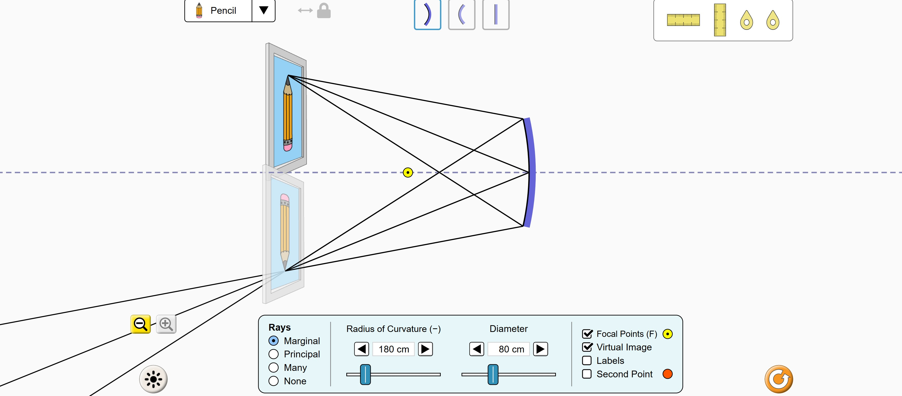
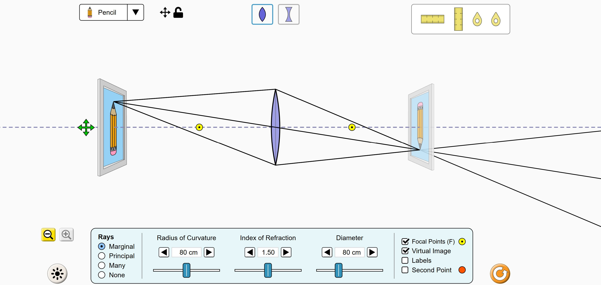

<!--
============================================================================
GUIDA: come generare il PDF
----------------------------------------------------------------------------
Apri il terminale in questa cartella (Laboratorio) e lancia:

    pandoc "Sistemi_ottici_Simulata.md" -o "PDF/Sistemi_ottici_Simulata.pdf"

Richiede pandoc + MiKTeX (pdflatex). Le immagini "Immagini/Specchio.jpg" e
"Immagini/Lenti.jpg" devono trovarsi nella sottocartella Immagini.
============================================================================
-->

# Introduzione e obiettivi

Gli **specchi curvi** e le **lenti** sono i mattoni di quasi tutti gli
strumenti ottici: occhiali, macchine fotografiche, microscopi, telescopi —
e anche il nostro occhio. In questa esperienza useremo la simulazione
**Geometric Optics** del progetto PhET per capire **come si formano le
immagini** e per verificare sperimentalmente la **legge dei punti coniugati**
(la "legge degli specchi e delle lenti") e la **legge dell'ingrandimento**.

A differenza delle esperienze precedenti, questa volta **non costruiremo un
grafico**: verificheremo le leggi controllando che valgano, entro gli errori
di misura, per **almeno tre posizioni diverse dell'oggetto** — e impareremo a
prevedere che tipo di immagine si forma in ogni caso.

Gli obiettivi sono:

- conoscere fuoco, centro e asse ottico di uno specchio concavo e di una
  lente convergente;
- saper **costruire le immagini** con i raggi principali;
- distinguere immagini **reali** e **virtuali**, **dritte** e **capovolte**,
  **ingrandite** e **rimpicciolite**, e prevedere il caso giusto in base alla
  posizione dell'oggetto;
- verificare la legge dei punti coniugati $\dfrac{1}{p} + \dfrac{1}{q} =
  \dfrac{1}{f}$ per lo specchio concavo e per la lente convergente
  (almeno 3 posizioni ciascuno);
- verificare la legge dell'ingrandimento $G = \dfrac{h_i}{h_o} = \dfrac{q}{p}$.

\newpage

# Richiami teorici

## Lo specchio concavo: fuoco, centro, asse

Uno **specchio sferico concavo** è una calotta di sfera riflettente
dall'interno (come l'incavo di un cucchiaio). Gli elementi fondamentali:

- l'**asse ottico**: la retta di simmetria dello specchio;
- il **centro di curvatura** $C$: il centro della sfera a cui appartiene lo
  specchio; la sua distanza dallo specchio è il **raggio di curvatura** $R$;
- il **fuoco** $F$: il punto in cui convergono, dopo la riflessione, i raggi
  che arrivano paralleli all'asse ottico. La sua distanza dallo specchio è la
  **distanza focale**:

$$\boxed{\;f = \frac{R}{2}\;}$$

## Come si costruiscono le immagini: i raggi principali

Per trovare l'immagine di un punto bastano **due raggi** di cui conosciamo il
comportamento. Per lo specchio concavo:

1. il raggio **parallelo** all'asse ottico viene riflesso **passando per il
   fuoco** $F$;
2. il raggio che **passa per il fuoco** viene riflesso **parallelo** all'asse;
3. il raggio che passa per il **centro** $C$ colpisce lo specchio
   perpendicolarmente e **torna su se stesso**.

L'immagine del punto si forma **dove i raggi riflessi si incontrano**.

```{=latex}
\begin{figure}[H]
\centering
\begin{tikzpicture}[font=\footnotesize, line width=0.8pt, scale=0.95]
  % asse ottico
  \draw[dashed] (-7.2,0) -- (0.8,0);
  % specchio concavo
  \draw[line width=2.2pt, blue!65] (0.18,1.9) .. controls (-0.3,0) .. (0.18,-1.9);
  \node[right, blue!65, font=\scriptsize] at (0.28,1.5) {specchio};
  % punti notevoli
  \fill (-2.25,0) circle (2pt) node[below=2pt] {$F$};
  \fill (-4.5,0) circle (2pt) node[below=2pt] {$C$};
  % oggetto
  \draw[-{Latex}, very thick, green!55!black] (-6,0) -- (-6,1.2);
  \node[above, green!55!black, font=\footnotesize] at (-6,1.25) {$O$};
  % raggio 1: parallelo poi per F
  \draw[red, -{Latex}] (-6,1.2) -- (0,1.2);
  \draw[red] (0,1.2) -- (-4.2,-1.04);
  % raggio 2: per F poi parallelo
  \draw[red!60!orange, -{Latex}] (-6,1.2) -- (0,-0.72);
  \draw[red!60!orange] (0,-0.72) -- (-4.4,-0.72);
  % immagine
  \draw[-{Latex}, very thick, purple] (-3.6,0) -- (-3.6,-0.72);
  \node[above, purple, font=\footnotesize] at (-3.42,0.08) {$I$};
  % quote p e q
  \draw[{Latex}-{Latex}] (-6,2.15) -- (0,2.15) node[midway, above, font=\scriptsize] {$p$};
  \draw[{Latex}-{Latex}] (-3.6,-1.5) -- (0,-1.5) node[midway, below, font=\scriptsize] {$q$};
  \draw[gray!60] (-6,1.35) -- (-6,2.3);
  \draw[gray!60] (0,1.35) -- (0,2.3);
  \draw[gray!60] (-3.6,-0.9) -- (-3.6,-1.65);
  \draw[gray!60] (-0.05,-0.2) -- (-0.05,-1.65);
\end{tikzpicture}
\caption{Costruzione dell'immagine per uno specchio concavo con l'oggetto
$O$ oltre il centro $C$: il raggio parallelo si riflette per il fuoco, il
raggio per il fuoco si riflette parallelo. Dove i raggi riflessi si
incontrano si forma l'immagine $I$: \textbf{reale, capovolta e
rimpicciolita}.}
\end{figure}
```

## Immagini reali e immagini virtuali

- Un'immagine è **reale** se i raggi riflessi (o rifratti) **si incontrano
  davvero** in un punto: lì la luce c'è, e l'immagine si può **proiettare su
  uno schermo**. Le immagini reali di specchi e lenti sono **capovolte**.
- Un'immagine è **virtuale** se i raggi riflessi divergono e a incontrarsi
  sono solo i loro **prolungamenti** (dietro lo specchio, o dalla stessa
  parte dell'oggetto per la lente): l'occhio la vede, ma **non si può
  proiettare**. Le immagini virtuali sono **dritte**.

Il tipo di immagine dipende da **dove si trova l'oggetto** rispetto a $F$ e
$C = 2f$. Per lo specchio concavo (e, con le stesse soglie, per la lente
convergente):

| Posizione dell'oggetto | Immagine |
|:-----------------------|:---------|
| $p > 2f$ (oltre $C$) | reale, capovolta, **rimpicciolita** |
| $p = 2f$ (in $C$) | reale, capovolta, **stessa altezza** |
| $f < p < 2f$ (tra $C$ e $F$) | reale, capovolta, **ingrandita** |
| $p = f$ (nel fuoco) | non si forma (raggi paralleli) |
| $p < f$ (tra $F$ e lo specchio) | **virtuale, dritta, ingrandita** |

## Le lenti sottili convergenti

Una **lente convergente** (più spessa al centro) devia i raggi per
**rifrazione** — la legge di Snell dell'esperienza precedente! — e ha **due
fuochi** simmetrici, uno per lato, alla stessa distanza focale $f$. I raggi
principali:

1. il raggio **parallelo** all'asse esce dalla lente passando per il **fuoco
   posteriore**;
2. il raggio che passa per il **centro ottico** della lente prosegue
   **senza deviare**;
3. il raggio che passa per il **fuoco anteriore** esce **parallelo** all'asse.

```{=latex}
\begin{figure}[H]
\centering
\begin{tikzpicture}[font=\footnotesize, line width=0.8pt, scale=0.95]
  % asse ottico
  \draw[dashed] (-6.2,0) -- (4.6,0);
  % lente
  \fill[blue!25, opacity=0.7] (0,1.9) .. controls (0.45,0) .. (0,-1.9) .. controls (-0.45,0) .. (0,1.9);
  \draw[blue!65, line width=1pt] (0,1.9) .. controls (0.45,0) .. (0,-1.9) .. controls (-0.45,0) .. (0,1.9);
  \node[left, blue!65, font=\scriptsize] at (-0.4,1.6) {lente};
  % fuochi
  \fill (2,0) circle (2pt) node[below=2pt] {$F$};
  \fill (-2,0) circle (2pt) node[below=2pt] {$F$};
  % oggetto
  \draw[-{Latex}, very thick, green!55!black] (-5,0) -- (-5,1.2);
  \node[above, green!55!black, font=\footnotesize] at (-5,1.25) {$O$};
  % raggio 1: parallelo poi per F posteriore
  \draw[red, -{Latex}] (-5,1.2) -- (0,1.2);
  \draw[red] (0,1.2) -- (4.2,-1.32);
  % raggio 2: per il centro, dritto
  \draw[red!60!orange, -{Latex}] (-5,1.2) -- (0,0);
  \draw[red!60!orange] (0,0) -- (4.2,-1.008);
  % immagine
  \draw[-{Latex}, very thick, purple] (3.33,0) -- (3.33,-0.8);
  \node[above, purple, font=\footnotesize] at (3.52,0.08) {$I$};
  % quote
  \draw[{Latex}-{Latex}] (-5,2.15) -- (0,2.15) node[midway, above, font=\scriptsize] {$p$};
  \draw[{Latex}-{Latex}] (0,-1.8) -- (3.33,-1.8) node[midway, below, font=\scriptsize] {$q$};
  \draw[gray!60] (-5,1.35) -- (-5,2.3);
  \draw[gray!60] (0,1.95) -- (0,2.3);
  \draw[gray!60] (3.33,-1.0) -- (3.33,-1.95);
  \draw[gray!60] (0,-1.4) -- (0,-1.95);
\end{tikzpicture}
\caption{Costruzione dell'immagine per una lente convergente: il raggio
parallelo esce per il fuoco posteriore, il raggio per il centro ottico non
devia. L'immagine $I$ dell'oggetto $O$ si forma \textbf{dall'altra parte}
della lente: è reale e capovolta.}
\end{figure}
```

## La legge dei punti coniugati

Detta $p$ la distanza **oggetto–specchio** (o oggetto–lente) e $q$ la
distanza **immagine–specchio** (o immagine–lente), vale per entrambi la
stessa legge:

$$\boxed{\;\frac{1}{p} + \frac{1}{q} = \frac{1}{f}\;}$$

valida con $p$, $q$ e $f$ **positivi** nel caso di immagini **reali** (per le
immagini virtuali si usa la convenzione $q < 0$, ma nella verifica useremo
solo immagini reali).

## La legge dell'ingrandimento

Dette $h_o$ l'altezza dell'oggetto e $h_i$ quella dell'immagine,
l'**ingrandimento** (in valore assoluto) è:

$$\boxed{\;G = \frac{h_i}{h_o} = \frac{q}{p}\;}$$

Se $q > p$ l'immagine è **ingrandita** ($G > 1$); se $q < p$ è
**rimpicciolita** ($G < 1$).

## Richiami di analisi dati: come "verificare una legge"

Dalla legge dei punti coniugati possiamo ricavare la distanza focale
"misurata" a partire da $p$ e $q$:

$$f_{\text{mis}} = \frac{p \cdot q}{p + q}$$

La verifica funziona così: per ogni posizione dell'oggetto misuriamo $p$ e
$q$, calcoliamo $f_{\text{mis}}$ e la confrontiamo con la distanza focale
$f_{\text{att}}$ attesa (nota dalla simulazione), calcolando lo **scarto
percentuale**:

$$\delta\% = \frac{|f_{\text{mis}} - f_{\text{att}}|}{f_{\text{att}}} \times 100$$

Se lo scarto resta **piccolo** (entro qualche percento, compatibile con
l'errore di lettura dei righelli, $\Delta \approx 1$ cm) **per tutte le
posizioni provate**, la legge è verificata.

\newpage

\begin{center}
\fbox{\parbox{0.95\linewidth}{\centering
Nome e cognome: \rule{4cm}{0.4pt} \quad Classe: \rule{1cm}{0.4pt} \quad
Data: \rule{2cm}{0.4pt} \\[4pt]
Componenti del gruppo: \rule{11cm}{0.4pt}
}}
\end{center}

\vspace{0.3cm}

# Scheda di laboratorio

## Materiale occorrente

- un **PC** (o tablet) con browser e connessione a internet;
- questa scheda, una matita e una calcolatrice.

## La simulazione PhET

1. Andate su **https://phet.colorado.edu** e cercate la simulazione
   **"Geometric Optics"** (in italiano: *Ottica geometrica*) — oppure usate
   il collegamento diretto:
   \newline\small\texttt{https://phet.colorado.edu/sims/html/geometric-optics/}
   \newline\texttt{latest/geometric-optics\_all.html}\normalsize
2. In basso trovate **due schermate**: *Lens* (lente) e *Mirror* (specchio).

L'interfaccia (uguale nelle due schermate):

- in alto a sinistra scegliete l'**oggetto**: tenete la **matita** (*Pencil*);
- in alto al centro scegliete il tipo di specchio (**concavo**, convesso,
  piano) o di lente (**convergente**, divergente);
- in alto a destra c'è la **cassetta degli strumenti** con il **righello
  orizzontale** e il **righello verticale**: trascinateli nella scena per
  misurare distanze e altezze;
- nel pannello in basso: **Rays** (scegliete **Principal** per vedere i raggi
  principali della costruzione!), il **raggio di curvatura**, il diametro, e
  le caselle **Focal Points** (mostrare i fuochi: spuntatela!) e **Virtual
  Image**;
- la linea tratteggiata orizzontale è l'**asse ottico**; i **puntini gialli**
  sono i fuochi.

> **Come si misura.** Trascinate l'oggetto (la matita) tenendolo con la
> punta **sull'asse ottico**... anzi no: tenete la **base** della cornice
> sull'asse e misurate le distanze **lungo l'asse ottico**: $p$ dalla matita
> allo specchio/lente, $q$ dallo specchio/lente all'immagine. Usate il
> **righello orizzontale** per $p$ e $q$, quello **verticale** per le altezze
> $h_o$ e $h_i$. Errore di lettura: $\Delta = 1$ cm.

# Parte 1 — Lo specchio concavo

Aprite la schermata **Mirror** e scegliete lo specchio **concavo** (primo
pulsante). Impostate **Rays = Principal**, spuntate **Focal Points** e
impostate il **raggio di curvatura** a $R = 180$ cm.

{width=100%}

## Domande preparatorie (Parte 1)

**D1.** Con $R = 180$ cm, quanto vale la distanza focale attesa dello
specchio? $f_{\text{att}} = R/2 = \underline{\hspace{2cm}}$ cm.

**D2.** *Verifica con il righello:* trascinate il righello orizzontale e
misurate la distanza tra lo specchio e il **puntino giallo** (fuoco):
$f = \underline{\hspace{2cm}}$ cm. Coincide con $f_{\text{att}}$?

\vspace{0.8cm}

**D3.** Guardando i raggi nella simulazione, riconoscete i **raggi
principali**: quale raggio parte parallelo all'asse? Dove passa dopo la
riflessione? E il raggio che passa per il fuoco?

\vspace{1.2cm}

**D4.** Prima di misurare, **prevedete**: con l'oggetto **oltre il centro**
($p > 2f = 180$ cm), l'immagine sarà reale o virtuale? Dritta o capovolta?
Ingrandita o rimpicciolita? (Usate la tabella dei casi dei richiami teorici.)

\vspace{1.2cm}

## Esperimento A — Verifica della legge dei punti coniugati

Misurate $p$ e $q$ per **tre posizioni** dell'oggetto: una con $p > 2f$, una
con $p = 2f$ e una con $f < p < 2f$ (per esempio $p \approx 280$, $180$ e
$130$ cm). Per ogni riga calcolate $f_{\text{mis}} = \dfrac{p\,q}{p+q}$ e lo
scarto percentuale rispetto a $f_{\text{att}} = 90$ cm.

| Caso | $p$ (cm) | $q$ (cm) | $f_{\text{mis}} = \dfrac{pq}{p+q}$ (cm) | $\delta\%$ |
|:----:|:--------:|:--------:|:---------------------------------------:|:----------:|
| $p > 2f$ | | | | |
| $p = 2f$ | | | | |
| $f < p < 2f$ | | | | |

**Domanda A1.** *(Rispondete mentre misurate.)* Completate la tabella
qualitativa osservando l'immagine nei tre casi:

| Caso | Reale o virtuale? | Dritta o capovolta? | Più grande o più piccola? |
|:----:|:-----------------:|:-------------------:|:-------------------------:|
| $p > 2f$ | | | |
| $p = 2f$ | | | |
| $f < p < 2f$ | | | |

**Domanda A2.** Le previsioni della tabella teorica dei casi sono rispettate?

\vspace{1cm}

**Domanda A3.** Avvicinando l'oggetto allo specchio (con $p$ che scende verso
$f$), l'immagine si avvicina o si **allontana** dallo specchio? E quando
$p = f$ esattamente, che cosa succede ai raggi riflessi?

\vspace{1.2cm}

## Esperimento B — Verifica della legge dell'ingrandimento

Scegliete **una** delle tre posizioni dell'Esperimento A (indicate quale:
$p = \underline{\hspace{1.5cm}}$ cm) e misurate con il **righello verticale**
l'altezza dell'oggetto e quella dell'immagine:

$$h_o = \underline{\hspace{2cm}}\ \text{cm}
\qquad
h_i = \underline{\hspace{2cm}}\ \text{cm}$$

Calcolate l'ingrandimento nei **due modi** e confrontate:

$$G_1 = \frac{h_i}{h_o} = \underline{\hspace{2.2cm}}
\qquad\qquad
G_2 = \frac{q}{p} = \underline{\hspace{2.2cm}}$$

**Domanda B1.** $G_1$ e $G_2$ coincidono (entro gli errori)? La legge
dell'ingrandimento è verificata?

\vspace{1.2cm}

## Esperimento C — L'immagine virtuale (lo specchio da trucco)

Ora portate l'oggetto **tra il fuoco e lo specchio**: $p < f$ (per esempio
$p \approx 50$ cm). Se non vedete niente, spuntate la casella **Virtual
Image**.

**Domanda C1.** Da che parte dello specchio si forma l'immagine? È
disegnata con raggi "pieni" o tratteggiati? Che cosa significa?

\vspace{1.2cm}

**Domanda C2.** L'immagine è dritta o capovolta? Ingrandita o rimpicciolita?
Potreste proiettarla su uno schermo? Perché?

\vspace{1.2cm}

**Domanda C3.** Questo è il principio dello **specchio da trucco** (o da
barba): perché per usarlo dovete stare **vicini** allo specchio? Che cosa
vedreste allontanandovi oltre il fuoco?

\vspace{1.2cm}

\newpage

# Parte 2 — La lente convergente

Aprite la schermata **Lens** e scegliete la lente **convergente** (primo
pulsante). Impostate: **Rays = Principal**, **Focal Points** spuntato,
raggio di curvatura $R = 80$ cm, indice di rifrazione $n = 1{,}50$.

{width=100%}

## Domande preparatorie (Parte 2)

**D5.** A differenza dello specchio, la lente ha **due** fuochi: perché?
(Suggerimento: la luce può attraversarla in entrambi i versi.)

\vspace{1.2cm}

**D6.** *Misura preliminare della focale:* con il righello orizzontale
misurate la distanza tra il centro della lente e uno dei puntini gialli:
$f_{\text{att}} = \underline{\hspace{2cm}}$ cm. (Con $R = 80$ cm e
$n = 1{,}50$ dovreste trovare circa $80$ cm.)

**D7.** L'immagine reale data dalla lente si forma **dalla stessa parte**
dell'oggetto o **dall'altra parte**? E per lo specchio com'era?

\vspace{1.2cm}

## Esperimento D — Verifica della legge dei punti coniugati

Come per lo specchio: misurate $p$ e $q$ per **tre posizioni** dell'oggetto
(per esempio $p \approx 250$, $160$ e $120$ cm, cioè $p > 2f$, $p = 2f$ e
$f < p < 2f$) e completate la tabella:

| Caso | $p$ (cm) | $q$ (cm) | $f_{\text{mis}} = \dfrac{pq}{p+q}$ (cm) | $\delta\%$ |
|:----:|:--------:|:--------:|:---------------------------------------:|:----------:|
| $p > 2f$ | | | | |
| $p = 2f$ | | | | |
| $f < p < 2f$ | | | | |

**Domanda D1.** Anche qui, completate la tabella qualitativa:

| Caso | Reale o virtuale? | Dritta o capovolta? | Più grande o più piccola? |
|:----:|:-----------------:|:-------------------:|:-------------------------:|
| $p > 2f$ | | | |
| $p = 2f$ | | | |
| $f < p < 2f$ | | | |

**Domanda D2.** I casi della lente convergente seguono le **stesse regole**
dello specchio concavo? C'è qualche differenza in **dove** si forma
l'immagine?

\vspace{1.2cm}

## Esperimento E — Verifica dell'ingrandimento

Per una posizione a scelta ($p = \underline{\hspace{1.5cm}}$ cm), con il
righello verticale:

$$h_o = \underline{\hspace{2cm}}\ \text{cm}
\qquad
h_i = \underline{\hspace{2cm}}\ \text{cm}$$

$$G_1 = \frac{h_i}{h_o} = \underline{\hspace{2.2cm}}
\qquad\qquad
G_2 = \frac{q}{p} = \underline{\hspace{2.2cm}}$$

**Domanda E1.** La legge dell'ingrandimento è verificata anche per la lente?

\vspace{1cm}

**Domanda E2.** In quale caso ($p > 2f$ o $f < p < 2f$) la lente si comporta
come l'obiettivo di un **videoproiettore** (immagine grande e lontana)? E in
quale come quello di una **macchina fotografica** (immagine piccola e
vicina)?

\vspace{1.2cm}

## Esperimento F — La lente d'ingrandimento

Portate l'oggetto **tra il fuoco e la lente**: $p < f$ (per esempio
$p \approx 40$ cm), con **Virtual Image** spuntato.

**Domanda F1.** Da che parte della lente si forma l'immagine? È reale o
virtuale, dritta o capovolta, ingrandita o rimpicciolita?

\vspace{1.2cm}

**Domanda F2.** Avete appena costruito una **lente d'ingrandimento**! Da che
parte deve guardare l'osservatore per vedere l'immagine ingrandita? Perché la
lente d'ingrandimento funziona solo se l'oggetto è **più vicino della
focale**?

\vspace{1.5cm}

**Domanda F3.** *(Per esplorare.)* Selezionate ora la lente **divergente**
(secondo pulsante) e spostate l'oggetto avanti e indietro: che tipo di
immagine ottenete, e come cambia con la posizione? Riuscite a ottenere
un'immagine reale?

\vspace{1.5cm}

# Conclusioni

**C1.** La legge dei punti coniugati è verificata per lo specchio concavo e
per la lente convergente? Riportate lo scarto percentuale massimo che avete
trovato e commentate se è compatibile con l'errore di lettura dei righelli.

\vspace{1.5cm}

**C2.** Riassumete con parole vostre: quando un sistema ottico produce
un'immagine **reale** e quando una **virtuale**? Quali immagini si possono
proiettare su uno schermo?

\vspace{1.5cm}

**C3.** Un'immagine **capovolta** può essere virtuale? Un'immagine
**virtuale** può essere capovolta? Rispondete usando i casi osservati.

\vspace{1.5cm}

**C4.** Per ogni strumento, dite se usa un'immagine reale o virtuale e in
quale zona ($p > 2f$, $f < p < 2f$, $p < f$) lavora l'oggetto:
**videoproiettore**, **macchina fotografica**, **lente d'ingrandimento**,
**specchio da trucco**.

\vspace{1.5cm}

**C5.** Quali fonti di errore ci sono in questa esperienza simulata? Quali
difficoltà **in più** avrebbe la stessa verifica in un laboratorio reale con
un banco ottico, una candela e uno schermo?

\vspace{1.5cm}

\begin{center}\textit{Fine dell'esperienza}\end{center}
